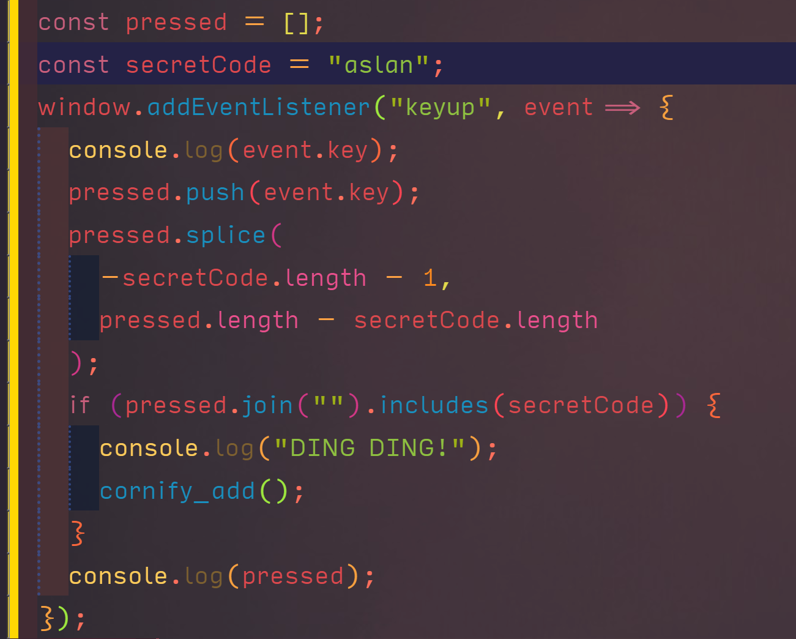

# Enzo for Visual Studio Code

Custom vscode theme with extended syntax sugar. Based off @idleberg's [hopscotch](https://github.com/idleberg/vscode-hopscotch) vscode theme with inspiration from [[eppz' unity syntax and theme extension]](https://github.com/eppz/VSCode.Extension.eppz_Code)

## TODO

[] collate palette reference into variables.json
[] strip out as much syntax hilighting as possible from hilighting regex extension
[] research adding hilighting settings into extension somehow?

## Build Process

Added the ability to use variables in JSON files using node module [variable-replacer](https://www.npmjs.com/package/variable-replacer). Just run render.sh from CLI to render a new version of enzo.json theme.

## License

This work is licensed under the [Creative Commons CC0 1.0 Universal License](http://creativecommons.org/publicdomain/zero/1.0/legalcode).
