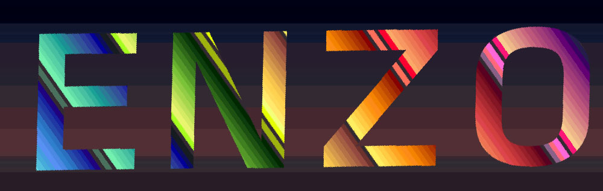

# Enzo for Visual Studio Code

Custom vscode theme with extended syntax sugar.


## "Layers" of the theme

This theme goes way beyond the built in theming api. As such there are 3 "layers" to it.

1. Simple base theme using the built in vscode theme api.
2. Regex based highlighting rules.
3. CSS code injection.

### 1. Textmate theme file

This is installed like any other theme. I also added the ability to use variables in JSON files using node module [variable-replacer](https://www.npmjs.com/package/variable-replacer). Make your edits to the src/source-enzo.json or the variables.json file then run src/render.sh from CLI to render a new version of themes/enzo.json.

Note, the theme is divided into two parts. The workbench theming is handled with the colors section, and the editor hilighting is handled in the tokenColors section.

### 2. Regex based highlighter

Install [[this vscode extension]](https://marketplace.visualstudio.com/items?itemName=fabiospampinato.vscode-highlight).

Why use a regex based highlighter when the [built in vscode syntax highlighter](https://code.visualstudio.com/api/language-extensions/syntax-highlight-guide) also uses regex?

Simple. vscode syntax highlighting only gives you access to two styling options: foreground color and background color.

While the regex based highlighter gives you access to the full [[Themable Decoration Render Options]](https://code.visualstudio.com/api/references/vscode-api#ThemableDecorationRenderOptions). This means in addition to background and forground color you can also set a border with radius/width etc, and a whole bunch of other stuff. (it doesn't give you full access to all css properties which is a bit of a shame)

It has [[been]](https://github.com/microsoft/vscode/issues/32813) [[proposed]](https://github.com/microsoft/vscode/issues/76935) [[that]](https://github.com/microsoft/vscode/issues/77133) this stuff be made available to syntax extensions etc but at this time this has not been done. If you'd like to see this stuff added to vscode I encourage you to go and make your support known in those tickets.

To use the syntax hilighting patterns that I designed, you just need to copy the contents of syntaxes/highlight.json into your settings.json

### 3. CSS code injection

The final thing you can do to spruce stuff up is to actually inject css/js into vscode. To do this [[install this extension]](https://marketplace.visualstudio.com/items?itemName=be5invis.vscode-custom-css).

This is super powerful because it means that you get full CSS properties access to elements of the vscode interface.

Atom is apparently pretty straightforward to theme because all the elements in the DOM have consistent class names but in vscode they're programmatically generated. [[At least I think that's the issue...]](https://github.com/microsoft/vscode/issues/51956).

Because of this sometimes css class names will randomly change for no apparently reason which then will break the custom injection stuff. So... caveat emptor!

The CSS injection style sheet can be found in the folder injectedTheme-vscdoe/styles.css. injectedTheme is itself it's own git repo with a gulp based SCSS build system.

To install the injected theme you need to copy the styles.css file somewhere on your computer (I keep mine in my dot files repo), and then link the css/js injector extension to that file by putting something like this in your settings:

```
{
  "vscode_custom_css.imports": [
    "file:///folder/folder/blahblah/folder/styles.css"
    ]
}

```

At some point I'd like to combine the theme, my settings file, and injectedTheme all into one master build system, but this will have to do for now.

_additional notes on code injection_:
While you can use CSS injection to style any CSS property the way it actually ends up getting rendered is sort of wonky. For instance I wanted to try to add padding to some of the custom highlighting I'd made for html and php tags, but it was doing some weird double rendering stuff. I think this might have something to do with the way that the vscode editor uses canvas now, but not entirely sure.

## Additional extensions I recommend for expanding theming possibilities

Check out [[this blog post]](#) to see some of the other extensions I recommend for improving the visual-semantic represenation of code in vscode.

## Credits

icon made using base by [[prettycons]](https://www.flaticon.com/authors/prettycons) licensed under CC 3 from flaticons.

The original theme colors were based on hopscotch, specifically [[idleberg's]](https://github.com/idleberg/vscode-hopscotch) implementation.

Huge inspiration from [[eppz' unity vscode theme]](https://github.com/eppz/VSCode.Extension.eppz_Code). It's fucking genius!

First, while I've been fiddling around with injection for awhile it's Robb Owen's awesome use of it in [[Synthwave84]](https://marketplace.visualstudio.com/items?itemName=RobbOwen.synthwave-vscode) that inspired me to finally package this stuff up for other people to use. I was like "ooooh duh! you can make text glow! ah!"

Someday I'd like to maybe even play with [animation loops](https://codepen.io/FelixRilling/pen/qzfoc) for styling. Is it in good taste? IDK, but **does this theme look like it was ever in good taste???**

## License

This work is licensed under the [Creative Commons CC0 1.0 Universal License](http://creativecommons.org/publicdomain/zero/1.0/legalcode).

# TODO:

- [ ] strip background color from html/php tags, and angular/react javascript interpolation
- [ ] add background color in with targeted css injection based on those regex targets
- [ ] clean up vscode injectedTheme in relation to enzo
- [ ] part out the scss stuff in injectedTheme
- [ ] delete extra syntax stuff
- [ ] pull out theming from settings file and rely only on theme (to make it easier to switch to eppz as needed for Unity dev)
- [ ] Add language specific targeting to regex hilighting
- [ ] 